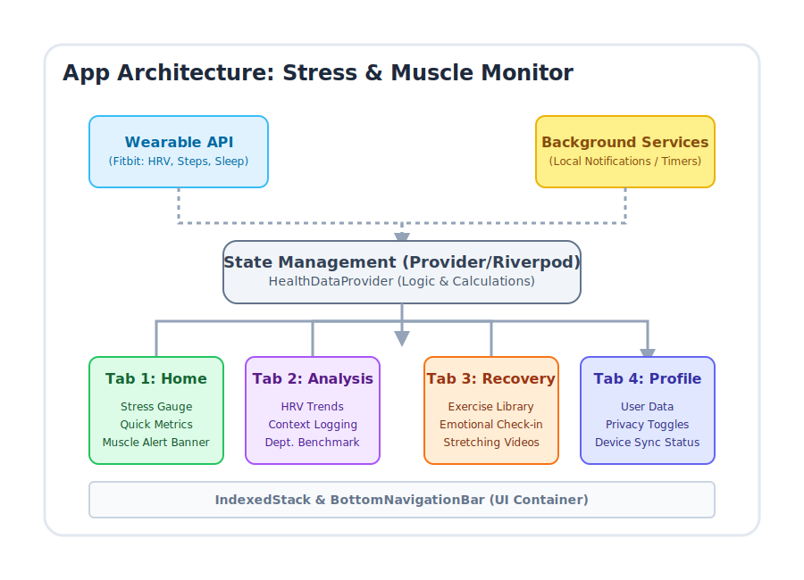

# 🧠 Stress Monitor & Muscle Preservation App  Architecture: 

> ( Nome da scegliere )

## 📌 Project Overview
This mobile application focuses on employee well-being as it balances "cold" biometric data (via Wearable APIs like Fitbit) with "hot" psychological data (Emotional Check-ins) to monitor stress levels and prevent muscle loss due to workplace sedentism. 

The architecture is built on the principles of **Health Design Thinking**:
- **Human-centered**: Designed with empathy to avoid overwhelming a stressed user.
- **Privacy-first**: Transparent data management to build trust between employees and the company.

> ( altra roba di Cappon ) 

---

## 🏛️ UI Architecture (The 4-Tab Navigation)
Theapp utilizes a flat navigation pattern via a `BottomNavigationBar` paired with an `IndexedStack` to preserve state across tabs.

### 1. Homepage
Focuses on immediate feedback and context-aware alerts.
- widget colorato (sort of graphic indicator)
- Tasto pausa 
- Metriche veloci 
- Facce sorridenti (feedback della giornata) 
- Obiettivo (mini-counter)


---

### 2. Analysis & Trends
- listview con metriche (con possibilità di vederle giorno per giorno) con Stress Index per primo.
- Cliccando sulla singola metrica si vede il trend di quella metrica (settimana/mese)


---

### 3. Recovery & Check-in
Actionable tools to mitigate stress and physical tension.
- 4 esercizi "generici" rapidi (al centro)
- listview scrollabile con tutti gli esercizi (filtrabili in ordine alfabetico, di tempo o per distretto)
- tasto di "cerca esercizio" che apre uno schermo con immagine del corpo (indica cosa vorresti allenare) e tempo (quanto tempo hai a disposizione)


---

### 4. Profile & Privacy
User control center ensuring total data transparency.
- Dati personali
- Report mensile (raccolta annuale)
- Notifiche (veloce con on-off e impostazioni)
- Obiettivi


---

## 💻 Technical Stack & Implementation Plan

### Folder Structure

```text
lib/
 ├── main.dart                      # Punto di ingresso dell'app (codice che runna)
 ├── screens/                       # (Tutti gli schermi principali)
 │    ├── home_page.dart            
 │    ├── analysis_and_trends.dart  
 │    ├── exercise_page.dart        
 │    └── user_profile.dart         
 ├── services/                      # (Chiamate API, DB locale)
 │    └── api_service.dart
 ├── providers/                     # (State Management)
 │    └── health_data_provider.dart
 ├── widgets/                       # (Componenti UI riutilizzabili)
 │    ├── metric_trend_chart.dart
 │    └── time_period_selector.dart
 ├── models/                        # (Strutture Dati / JSON parsing)
 │    ├── metric_point.dart
 │    └── health_metrics.dart
 └── utils/                         # (Logica matematica e calcoli)
      └── stress_calculator.dart    # Algoritmo dello IUSM
```

### 2. Diagramma Architetturale (Codice SVG)




### 3. Demo (da prendere con le pinze) 

https://app.nowa.dev/home-page


> Nota: Potrebbe capitare che un processo "asincrono" venga compilato dopo il build method che dovrebbe aggiornare (Esempio di counter con valore Null di partenza, il valore di default era Null e non il valore precedente per un missmatch nella velocità di compilazione). Questo classico errore di save-state si può risolvere con uno special widget "future builder". Future builder è un widget che builda seguendo il valore di un "future". Inoltre, è importante rimuovere "init state" da qualsiasi processo asincrono. Praticamente basta rifattorizzare il codice usando un "future builder". 


## :heavy_division_sign: Models and Indexes : 


### About Stress... 

Lo stress, definito biologicamente come uno stato di minaccia all'omeostasi, innesca complesse risposte neuroendocrine e autonomiche. L'esposizione prolungata a tali fattori di stress, in assenza di un recupero adeguato, conduce a un accumulo di usura fisiologica clinicamente denominato "carico allostatico". La capacità di prevedere e quantificare accuratamente questo stato in tempo reale offre enormi prospettive per interventi sanitari personalizzati, modifiche comportamentali e la prevenzione di patologie cardiometaboliche e psichiatriche croniche.

La Variabilità della Frequenza Cardiaca (HRV)—la fluttuazione microscopica nel tempo tra battiti cardiaci consecutivi (intervalli R-R o N-N)—funge da proxy più accessibile e affidabile per l'equilibrio del SNA.

Le metriche del dominio del tempo quantificano la quantità di variabilità nelle misurazioni degli intervalli interbattito consecutivi. Il parametro più diffuso è la Radice quadrata della media dei quadrati delle differenze successive (RMSSD). Questa metrica è il proxy principale per stimare le fluttuazioni parasimpatiche mediate dal vago ed è la più robusta per le letture a breve termine e per i dispositivi mobili. Poiché i dati RMSSD nelle popolazioni generali sono fortemente asimmetrici, i modelli all'avanguardia applicano abitualmente una trasformazione logaritmica naturale ($lnRMSSD$) per normalizzare la distribuzione ai fini della modellazione statistica e dell'integrazione algoritmica. Questo passaggio è cruciale per correggere gli artefatti di movimento tipici dei dispositivi indossabili e aumentare la riproducibilità del dato. Un'altra metrica fondamentale è la Deviazione Standard degli intervalli N-N (SDNN), che riflette la variabilità totale ed è influenzata sia dall'attività simpatica che da quella parasimpatica, rendendola una misura più ampia della salute autonomica complessiva.

La quantificazione dello stress simpatico acuto dai dati dei dispositivi indossabili si affida frequentemente all'Indice di Stress di Baevsky (Baevsky Stress Index, BSI). Sviluppato originariamente per il programma spaziale russo negli anni '60 per monitorare l'affaticamento dei cosmonauti, il BSI è diventato una metrica SOTA per valutare lo stress fisiologico in tempo reale tramite dispositivi mobili e sensori PPG

L'Indice di Stress di Baevsky viene calcolato analizzando specifici parametri dell'istogramma degli intervalli interbattito, utilizzando la seguente equazione:

$BSI = \frac{AMo}{2 \times Mo \times Mx DMn}$

Le variabili strutturali dell'equazione sono definite come segue:
 - Moda ($Mo$): Il valore dell'intervallo R-R più frequente (misurato in secondi), che indica il livello nominale di funzionamento del sistema cardiovascolare. Sotto stress, la frequenza cardiaca aumenta, causando una diminuzione della Moda.
 - Ampiezza della Moda ($AMo$): La percentuale di intervalli R-R che rientrano nel bin della Moda (solitamente calcolato con una tolleranza di $\pm 50$ ms). Un $AMo$ più elevato indica una maggiore rigidità del ritmo e un controllo simpatico più forte. Quando il SNS domina, la maggior parte dei battiti ha la stessa esatta durata.
 - Intervallo di Variazione ($MxDMn$): La differenza tra l'intervallo R-R massimo e minimo (in secondi), che riflette la variabilità complessiva.

Per normalizzare la metrica per le applicazioni rivolte agli utenti e ridurre l'impatto di valori anomali estremi, la radice quadrata del BSI viene spesso utilizzata come Indice di Stress normalizzato ($SI$):

$$SI = \sqrt{BSI}$$

La ricerca che implementa il BSI nella tecnologia della salute indossabile (come la Baevsky's Enhanced Stress Technique o BEST) stabilisce soglie cliniche specifiche misurate in unità convenzionali (c.u.). 

Un $SI$ inferiore a $7.07$ c.u. indica un livello ottimale e un basso livello di stress. 
Un $SI$ compreso tra $7.07$ e $12.2$ c.u. (che corrisponde a un BSI grezzo compreso tra 50 e 150) indica un'adattabilità normale del sistema.
Valori di $SI$ superiori a $12.2$ c.u. sono classificati come stress elevato o sovraccarico allostatico acuto. 

Integrare l'algoritmo BSI in un'applicazione mobile fornisce una metrica altamente reattiva e immediata per lo sforzo fisiologico quotidiano, che integra matematicamente l'indicatore di recupero a lungo termine rappresentato dall'RMSSD notturno.

> Warning: Una sfida algoritmica primaria nel rilevamento dello stress tramite dispositivi indossabili è la profonda sovrapposizione fisiologica tra lo stress psicologico e lo sforzo fisico. Entrambi gli stati suscitano una risposta autonomica caratterizzata da un'elevata frequenza cardiaca e da una ridotta HRV. Se un algoritmo valuta i dati cardiovascolari nel vuoto, penalizzerà erroneamente il punteggio di stress dell'utente durante una camminata veloce o una sessione in palestra, confondendo l'adattamento metabolico con l'esaurimento psicologico.Per risolvere questa criticità, lo stato dell'arte impiega il gating contestuale, sfruttando i dati del movimento (passi giornalieri, calorie bruciate attive) per differenziare lo stress mentale dallo stress fisico. Questa metodologia costituisce la base della tecnica BEST e dei modelli di "Frequenza Cardiaca Aggiuntiva" (Additional Heart Rate - aHR). L'assunto di base è che se il sistema nervoso è attivato in assenza di un fabbisogno metabolico muscolare, l'attivazione è di natura psicologica o immunitaria.

Modelli Predittivi Metabolici e l'aHR

Il concetto di aHR isola le fluttuazioni della frequenza cardiaca associate specificamente allo stress psicosociale sottraendo matematicamente le richieste metaboliche del movimento. L'algoritmo stima la frequenza cardiaca prevista per un determinato carico fisico introducendo i dati sull'attività fisica in un modello lineare generalizzato. Questo modello si basa su equazioni fisiologiche fondamentali, come il principio di Fick e il principio della gittata cardiaca, che legano il dispendio energetico (calorie attive e a riposo) all'attività cardiovascolare:

$$aHR = HR_{osservata} - HR_{prevista\_dal\_movimento}$$

Se la frequenza cardiaca osservata supera significativamente la domanda fisica prevista, l'elevazione residua ($aHR$) viene attribuita a stress psicologico o fisiologica.

Nell'applicazione pratica per lo sviluppo di app mobili, il protocollo BEST utilizza un Indice di Attività (Activity Index - AI) derivato dai dati dell'accelerometro (o dai conteggi dei passi e dal dispendio calorico attivo) per classificare le epoche di dati continui in base allo stato cinematico dell'utente. Utilizzando tecniche di apprendimento automatico come il clustering K-means o XGBoost, l'attività viene segmentata in livelli.

La logica algoritmica applica quindi i seguenti principi di classificazione:Bassa Attività (Basse calorie attive/passi nulli) + Alto BSI/HR: Classificato come stress mentale o psicologico acuto. L'utente è fisicamente fermo, ma il suo sistema nervoso autonomo è altamente eccitato. Questo evento degrada l'Indice di Stress.

Alta Attività (Alte calorie attive/molti passi) + Alto BSI/HR: Classificato come sforzo fisico. Questa è una risposta fisiologica benefica e attesa, e deve contribuire positivamente a un "Punteggio di Attività o Carico", mentre il calcolo dello stress psicologico viene sospeso per evitare falsi positivi.Bassa Attività + Basso BSI/HR: Classificato come riposo, recupero o "Tempo Ristoratore".Disabilitando o riponderando il calcolo dello stress psicologico durante i periodi con un elevato numero di passi o di consumo calorico attivo, l'algoritmo previene letture fallaci e garantisce che l'indice finale rifletta accuratamente il reale carico allostatico dell'utente.

### Quantificazione dell'Architettura del Sonno e Dinamiche di Recupero 

Un indice del sonno SOTA non si limita a valutare la durata totale a letto, ma deve aggregare matematicamente il tempo totale di sonno effettivo, la stadiazione (fasi) e la continuità (interruzioni), trasformando l'orologio biologico in un fenotipo digitale del recupero

I dati recuperati tramite l'app in merito alle fasi del sonno (Profondo, REM, Leggero) devono essere ponderati algoritmicamente in base alle loro distinte funzioni ristoratrici, in quanto la biologia attribuisce pesi diversi a ciascuna fase:

Sonno Profondo (NREM Stadio 3): Costituendo storicamente circa il 20-25% di un ciclo di sonno sano in individui giovani e in salute, il sonno profondo è critico per il recupero fisico. Durante questa fase, la frequenza cardiaca e la pressione sanguigna scendono ai livelli più bassi delle 24 ore, la dominanza parasimpatica raggiunge il picco massimo e il sistema endocrino secerne l'ormone della crescita umano (HGH) per la riparazione cellulare, la sintesi muscolare e la regolazione del sistema immunitario.

Sonno REM (Rapid Eye Movement): Rappresentando un ulteriore 20-25% della notte, il sonno REM è caratterizzato da un'attività cerebrale elettroencefalografica che ricorda la veglia, accompagnata da atonia (paralisi muscolare) e movimenti oculari. Il sonno REM è essenziale per il ripristino cognitivo, la regolazione emotiva, la creatività e il consolidamento della memoria a lungo termine. Da un punto di vista dell'indice di stress, una carenza di REM è altamente correlata all'irritabilità emotiva e al calo delle prestazioni mentali il giorno successivo.

Sonno Leggero (NREM Stadi 1 e 2): Servendo come fasi di transizione, il sonno leggero comprende la maggior parte della notte (circa il 50%) e funge da cuscinetto neurofisiologico, ma offre un valore ristoratore meno denso rispetto alle fasi Profonda o REM.

Bisogna valuare la natura dei dati del sonno a disposizione e decidere come procedere. 

### Linee di Base HRV Basate su Età e Sesso

La funzione autonomica degrada naturalmente con l'avanzare dell'età. Studi epidemiologici che hanno analizzato migliaia di registrazioni di monitor Holter rivelano un declino quasi lineare delle metriche parasimpatiche (RMSSD, SDNN, HF) e un aumento relativo del rapporto LF/HF man mano che le popolazioni invecchiano, indicando un graduale spostamento verso la dominanza simpatica e una perdita di complessità ritmica.Per contestualizzare, il 50° percentile dell'RMSSD per un maschio o una femmina di età compresa tra 18 e 24 anni può situarsi vicino ai 50-60 ms, mentre la mediana per una fascia di età compresa tra 55 e 64 anni scende a circa 25 ms. Inoltre, le femmine in pre-menopausa presentano tipicamente una maggiore dominanza parasimpatica e una maggiore complessità della HRV rispetto ai maschi di pari età, sebbene questa differenza si attenui nel periodo post-menopausale. Di conseguenza, un algoritmo deve scalare la HRV grezza dell'utente rispetto a distribuzioni specifiche per età e genere per determinare accuratamente se un valore è "basso" (stressato) o "alto" (recuperato) per la sua specifica fisiologia. Valutare un utente di 60 anni con la scala di un utente di 20 anni comporterebbe la classificazione permanente del soggetto anziano in uno stato di esaurimento allostatico critico, rendendo l'indice inutile.


| Fascia d'Età (Anni) | Percentile 10°–90° RMSSD (Maschi) | Percentile 10°–90° RMSSD (Femmine) | Mediana Approssimativa |
|---|---|---|---|
| 18–24 | 27 – 73 ms | 27 – 82 ms | ~ 50 ms |
| 25–34 | 24 – 60 ms | 24 – 73 ms | ~ 45 ms |
| 35–44 | 21 – 52 ms | 21 – 60 ms | ~ 35 ms |
| 45–54 | 19 – 46 ms | 19 – 52 ms | ~ 30 ms |
| 55–64 | 17 – 40 ms | 17 – 46 ms | ~ 25 ms |

### Composizione Corporea, Adiposità e Resilienza Autonomica

L'inclusione dei dati sulla composizione corporea (Massa Grassa vs. Massa Magra) derivati da bilance intelligenti, oltre alle semplici misurazioni di altezza e peso (BMI), fornisce un profondo vantaggio algoritmico. Nella moderna fisiologia, il tessuto adiposo non è considerato biologicamente inerte; è riconosciuto come un organo endocrino altamente attivo che secerne cronicamente citochine pro-infiammatorie e ormoni che modulano la regolazione dell'energia e dell'immunità. Questo ambiente infiammatorio ha un impatto diretto sul Sistema Nervoso Autonomo. 

In termini algoritmici, la percentuale di massa grassa deve fungere da modificatore fisiologico cronico. Un utente con una percentuale di grasso corporeo ottimale (ad esempio, 15% per un uomo, 22% per una donna) è generalmente caratterizzato da un tono vagale più elevato, da un sistema neuro-endocrino meno incline all'iper-attivazione e da una cinetica di recupero muscolare e nervosa più rapida. Di conseguenza, un indice composito avanzato regola la "velocità di ricarica" attesa in base alle metriche della massa magra, prevedendo un rimbalzo fisiologico leggermente prolungato in seguito a stress acuto o attività intensa per gli utenti con una maggiore adiposità centrale.

### Indice finale di Stress 

Per soddisfare rigorosamente i requisiti del progetto serve creare un indice che riassuma in modo univoco il livello di stress avendo accesso esclusivo a: 

- Battito e HRV, dati sul Sonno (ore, fasi, interruzioni)
- Movimento (passi, calorie attive/riposo)
- Dati Demografici (altezza, peso, età)
- Composizione Corporea (massa grassa/magra)

Serve sviluppare un modello matematico gerarchico e stratificato. Questa architettura algoritmica proposta, denominata Indice Unificato di Stress Multimodale (IUSM), sintetizza la letteratura biomedica discussa e lo stato dell'arte commerciale in un motore di calcolo unificato. Lo IUSM opera su una scala giornaliera da 0 a 100, dove 100 rappresenta la perfetta omeostasi fisiologica (massima resilienza e recupero) e 0 rappresenta l'esaurimento fisiologico totale (massimo stress e vulnerabilità allostatica).

L'indice si calcola dinamicamente aggregando tre sotto-punteggi distinti: 
- Sotto-punteggio di Recupero Notturno ($S_{rec}$)
- Sotto-punteggio di Sforzo Metabolico Accumulato ($S_{sforzo}$)
- Sotto-punteggio di Stress Simpatico in Tempo Reale ($S_{stress}$).

L'intera equazione è ancorata a un Fattore di Calibrazione di Base ($C_{base}$) generato al momento dell'installazione dell'app.

Fase 1: Calibrazione Demografica e della Composizione Corporea ($C_{base}$). Prima che vengano generati punteggi dinamici, l'algoritmo stabilisce il potenziale fisiologico assoluto dell'utente basandosi su vincoli anagrafici e metabolici a lenta variazione. 

1. Ancoraggio Demografico (Età, Sesso): Il sistema interroga una matrice di database normativo (simile alla Tabella di prima) per identificare l'HRV atteso (RMSSD mediano) e le soglie di frequenza cardiaca a riposo per l'utente, basandosi sulla sua età e sul suo genere. Questo determina il denominatore per tutti i calcoli di "deviazione dalla norma". 

2. Modificatore Adiposo (BMI e Massa Grassa): Il sistema utilizza l'altezza, il peso e il dato bonus fornito dalla bilancia smart (Massa Grassa % / Massa Magra). Poiché è ampiamente dimostrato che il tessuto adiposo in eccesso sopprime il tono parasimpatico e accentua la dominanza simpatica, l'algoritmo applica un moltiplicatore di efficienza al tasso di recupero. Se la Massa Grassa è ottimale (es. 15-20% per gli uomini, 22-28% per le donne), il moltiplicatore metabolico è neutro ($1.0$). Se i dati indicano un'adiposità elevata, il moltiplicatore scende (es. $0.90$ o $0.85$). Ciò significa che il sistema assumerà una ridotta capacità del sistema nervoso di spegnere la risposta allo stress indotta da allenamenti o da tensione lavorativa, e degraderà la "velocità di ricarica" della batteria dell'utente in conformità alla fisiologia del soggetto.
  
Fase 2: Il Sotto-punteggio di Recupero Notturno ($S_{rec}$). Calcolato esclusivamente una volta al mattino, lo $S_{rec}$ stabilisce il valore di partenza giornaliero (il "serbatoio pieno"). È una media ponderata della misurazione del bilancio autonomico e dell'architettura del sonno.Fattore Architettura del Sonno (Peso 40%): Utilizzando i dati sulle ore totali, fasi e interruzioni, l'algoritmo riproduce le logiche del questionario clinico PSQI :Quantità: Punteggio base da 0 a 100 in proporzione al raggiungimento del fabbisogno per l'età dell'utente (generalmente 7-9 ore). Fasi: Si aggiungono "punti bonus" se l'utente supera la soglia critica del 20% di Sonno Profondo (rigenerazione ormonale/fisica) e del 20% di Sonno REM (recupero cognitivo).Continuità: Viene applicata una penalità logaritmica per le interruzioni notturne. Se i risvegli riducono l'efficienza del sonno sotto l'85%, il punteggio subisce una contrazione drastica, poiché la frammentazione distrugge i cicli di riparazione neuroplastica.Fattore Equilibrio HRV (Peso 60%): Il dato grezzo della variabilità cardiaca viene trasformato in $lnRMSSD$ e confrontato con la media mobile personale a 14 e 60 giorni dell'utente. Se l'$lnRMSSD$ della notte appena trascorsa si colloca entro 1 deviazione standard rispetto alla media a lungo termine, il recupero autonomico è ottimale e il sistema assegna punteggio pieno. Se il valore è significativamente depresso, indica che il sistema nervoso sta ancora lottando contro un fattore di stress (overtraining, alcol, malattia, ansia), imponendo un deficit immediato al punteggio mattutino.

Fase 3: Il Sotto-punteggio di Sforzo Metabolico Accumulato ($S_{sforzo}$)Mentre l'utente naviga la sua giornata, l'algoritmo traccia il dispendio fisico utilizzando il conteggio dei passi e la scomposizione delle calorie in attive e a riposo fornite dai sensori. Per evitare che un accumulo lineare porti rapidamente a un punteggio negativo, il punteggio di sforzo ($S_{sforzo}$) utilizza una funzione asintotica logaritmica. Passare da 0 a 5.000 passi accumula punti di sforzo molto velocemente, ma l'incremento da 15.000 a 20.000 passi genera un costo marginale molto inferiore, riflettendo la legge biologica dell'adattamento cardiovascolare allo stimolo aerobico continuo. Questo punteggio quantifica l'inevitabile usura fisica della veglia e decurta lentamente lo IUSM nel corso della giornata, dettando implicitamente il bisogno fisiologico di sonno per la notte successiva.

Fase 4: Sotto-punteggio di Stress Simpatico in Tempo Reale ($S_{stress}$)Per catturare lo stress mentale, psicosociale e cognitivo, l'algoritmo monitora in modo continuo l'Indice di Stress di Baevsky (BSI) applicando la tecnica di gating contestuale del movimento (protocollo BEST).Durante le epoche di tempo in cui i sensori registrano passi nulli o calorie attive quasi inesistenti (l'utente è fermo alla scrivania, nel traffico o sul divano), il sistema calcola l'indice di Baevsky dai dati del battito cardiaco ($SI = \sqrt{BSI}$).Se durante questi stati inattivi il parametro $SI$ eccede i $12.2$ c.u., l'algoritmo lo registra come un evento acuto di eccitazione simpatica inappropriata: un picco di stress mentale o ansia.L'algoritmo integra questi picchi di frequenza e rigidità cardiaca nel tempo. I minuti prolungati trascorsi in questo stato di alta rigidità R-R senza giustificazione muscolare erodono pesantemente l'indice IUSM.Se invece i passi sono elevati e le calorie attive salgono vertiginosamente, un $SI$ elevato o una frequenza cardiaca alta vengono incanalati nello $S_{sforzo}$, prevenendo la contaminazione della misurazione dello stress mentale.

Equazione Finale di Integrazione e Analisi PredittivaL'Indice Unificato di Stress Multimodale viene aggiornato e ri-renderizzato in tempo reale sul cruscotto dell'app. Al risveglio, il serbatoio dell'utente è al livello dettato dal recupero notturno moltiplicato per il suo potenziale di base costituzionale. Col procedere delle ore, questa riserva di resilienza si svuota a causa del metabolismo basale, dello sforzo muscolare logaritmico e della tassazione improvvisa generata dallo stress mentale acuto.L'espressione matematica generale semplificata si presenta come segue:

$$IUSM_{attuale} = - \alpha(S_{sforzo}) - \beta(S_{stress})$$

Dove i coefficienti $\alpha$ e $\beta$ sono parametri di ponderazione predefiniti nel backend (calibrabili tramite machine learning in futuro) che definiscono l'impatto distruttivo relativo dello sforzo muscolare rispetto alla tossicità del sovraccarico cognitivo autonomico sulla batteria fisiologica totale. Un'applicazione in grado di monitorare questo indice complesso fornisce all'utente finale un barometro impareggiabile della propria salute. Se lo $IUSM_{attuale}$ dovesse scendere al di sotto di una soglia predefinita (ad esempio, 30/100) nel primo pomeriggio, l'applicazione riceverebbe l'input necessario per attivare interventi comportamentali proattivi: suggerire l'interruzione del lavoro per sessioni di biofeedback o respirazione lenta per riattivare immediatamente il tono vagale, sconsigliare un allenamento cardio ad alta intensità a favore di uno yoga leggero, o avvisare l'utente di prioritizzare un ingresso anticipato nel ciclo del sonno per evitare l'instaurarsi a lungo termine di un pericoloso carico allostatico e il conseguente esaurimento nervoso. L'inclusione metodica della variabilità cardiaca, della dinamica dell'adiposità e dell'architettura vettoriale del sonno posiziona definitivamente questo indice ai vertici assoluti della fisiologia indossabile moderna.
